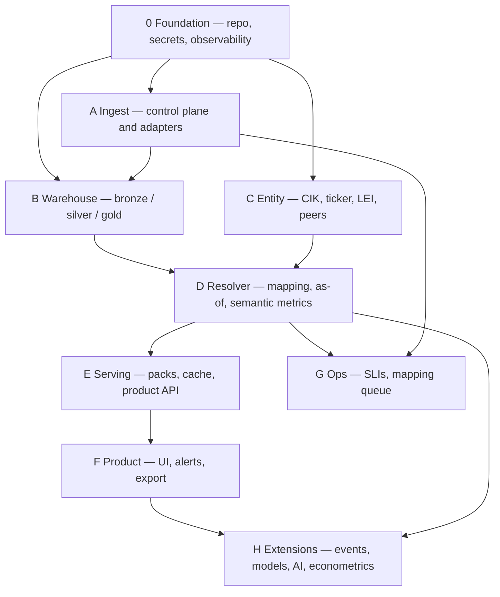
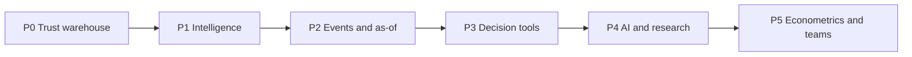
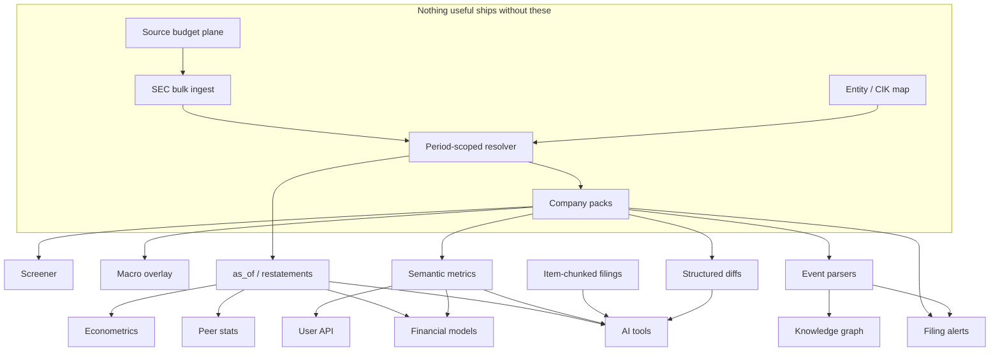
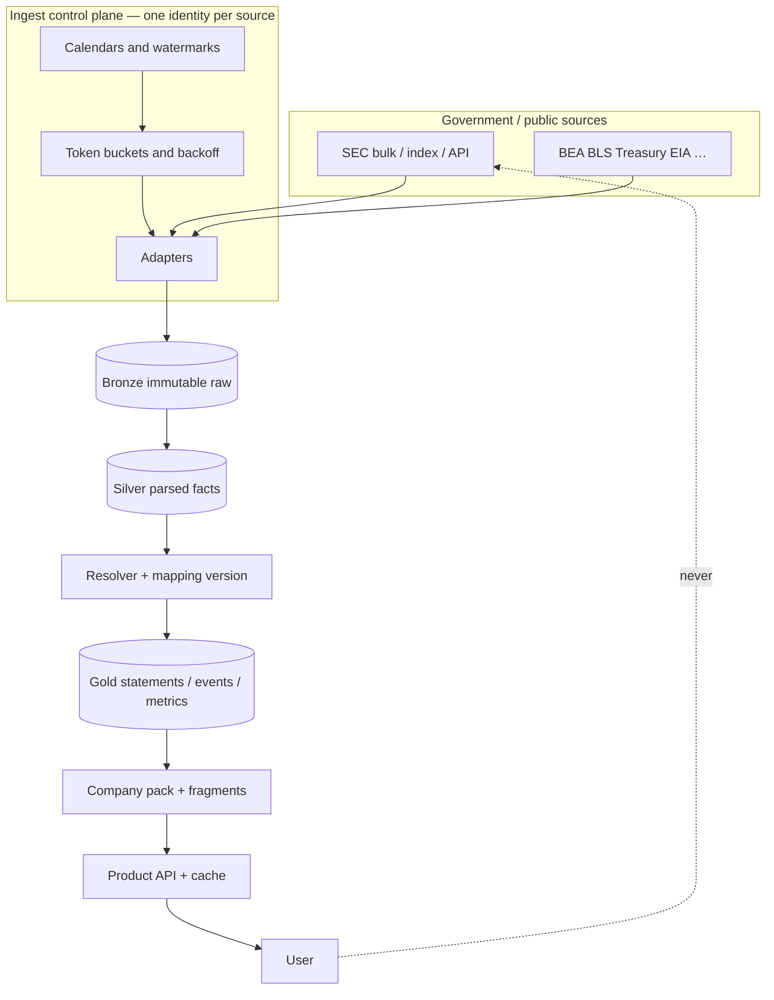
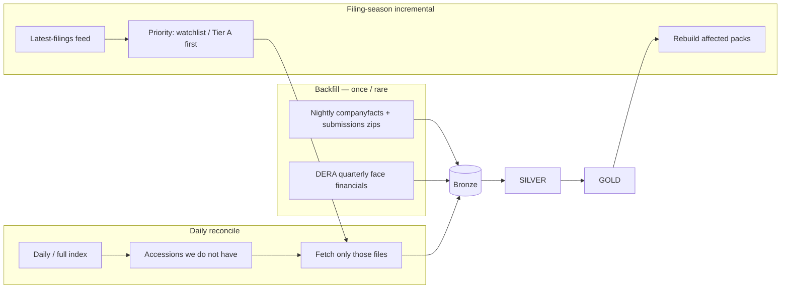
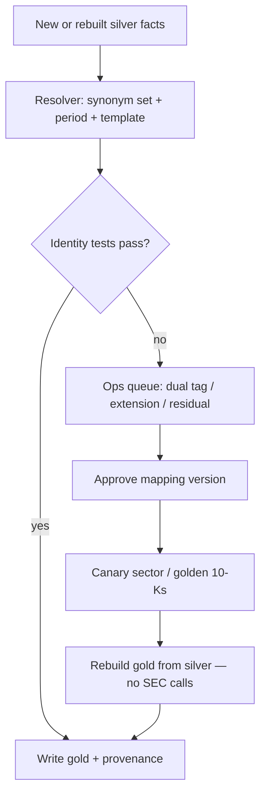
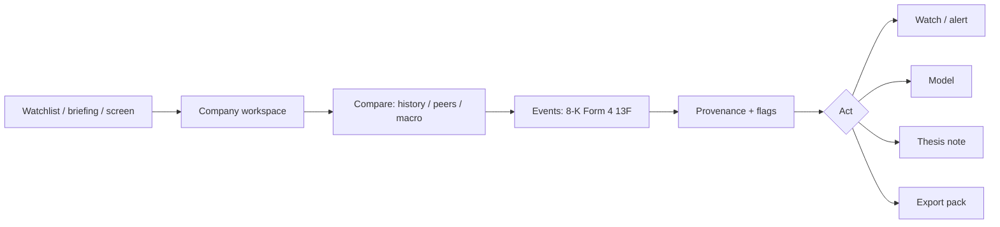
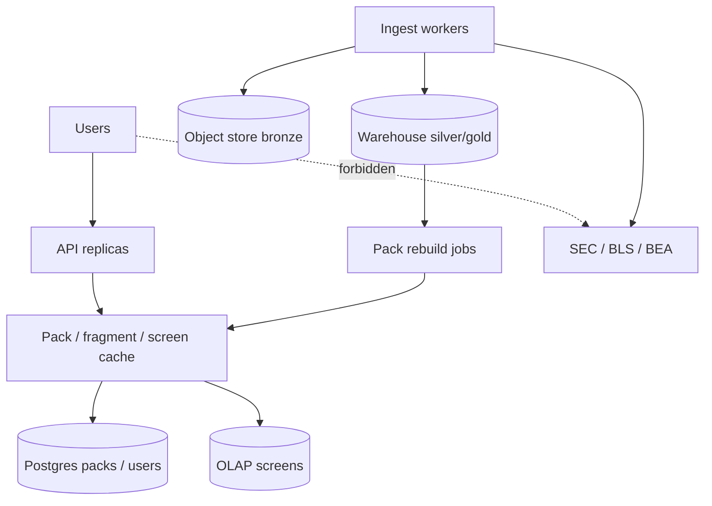

# Market Intelligence Platform — Build Plan

This is the build plan for the platform described in [MARKET_INTELLIGENCE_PLATFORM_INVESTIGATION.md](./MARKET_INTELLIGENCE_PLATFORM_INVESTIGATION.md). It includes the **project map** (what is built, in what order, with what dependencies), the **process map** (how work and data move), and the **build sequence** (what “done” means at each gate).

Agents and implementers should start with the collated [AI_GUIDE.md](./AI_GUIDE.md).

It does not estimate calendar duration. Difficulty is described by what must exist, what it depends on, and what breaks if you skip it.

**North star:** users never hit source APIs. They query a warehouse of comparable, sourced facts. A single identified ingest plane pulls government/public data without being flagged.

```text
Sources → ingest plane → bronze → silver → gold → product APIs
                                              ↓
                                    users decide (never call SEC)
```

---

## 1. Project map

The project is eight parallel workstreams that only *appear* sequential. Most later streams attach to the gold spine; they must not start until that spine exists.

### 1.1 Workstreams



| ID | Workstream | Owns | Must not own |
| --- | --- | --- | --- |
| 0 | Foundation | Repo layout, CI, secrets, logging, deploy skeleton | Product features |
| A | Ingest | Source adapters, budgets, bronze writes, watermarks | User HTTP handlers |
| B | Warehouse | Schemas, loads, rebuilds from bronze | Live API calls |
| C | Entity | Company identity, aliases, coverage tiers, peers | XBRL math |
| D | Resolver | Synonym sets, templates, `as_of`, semantic metrics | UI layout |
| E | Serving | Packs, screens, cache, product API | Source fetches |
| F | Product | Company workspace, screener, watchlists, export | Mapping rules |
| G | Ops | Data status, SLIs, mapping queue, source health | End-user research UX |
| H | Extensions | Events, models, AI, stats lab, econometrics | New ingest identities / extra IPs |

### 1.2 Phase map (capability layers)

Each phase is a **gate**. The next phase may be designed in parallel; it must not ship before the prior gate passes.



| Phase | User-visible outcome | Backend that must exist | Hard dependency |
| --- | --- | --- | --- |
| **P0** | Search a ticker, see sourced statements + filing list + data status | Ingest, bronze/silver, corporate resolver (~20 lines), entity table, read API | None |
| **P1** | Screen a universe; compare peers; see sector + macro overlay; watchlist filing alerts | Gold packs, peer stats, ~30 macro series, alert job on *your* index | P0 mapping QA |
| **P2** | 8-K / Form 4 / 13F on the company; as-of toggle; filing diffs | Bi-temporal facts, event parsers, fragment cache, event-driven rebuild | P1 packs |
| **P3** | User model on standardized actuals; quality flags; thesis journal; Excel pack | Semantic metrics, job runner, identity tests | P2 `as_of` |
| **P4** | Filing Q&A with citations; “what changed” brief; mapping suggestions | Item-chunked search, tool-calling into gold API | P3 metrics + diffs |
| **P5** | Isolated regressions; team workspaces; optional user API; licensed prices if signed | Snapshot compute, RLS/SSO, metric API | P4 retrieval discipline |

**Do not start P4 or P5 to “look advanced.”** They amplify whatever is wrong in P0–P2.

### 1.3 Dependency map (what blocks what)



Critical path: **budget plane → SEC bulk → entity → resolver → packs → everything else.**

If the resolver is weak, the screener, models, and AI are all confidently wrong.

### 1.4 Repository map (suggested monorepo)

```text
/
├── apps/
│   ├── web/                 # desktop-first research UI
│   └── admin/               # mapping queue, source health, coverage
├── services/
│   ├── ingest/              # adapters, scheduler, budgets  (never user-facing)
│   ├── resolver/            # mapping + semantic metrics
│   ├── api/                 # authenticated reads of gold
│   ├── jobs/                # alerts, packs, models, exports, AI briefs
│   └── search/              # filing index (P4)
├── warehouse/
│   ├── bronze/              # schemas + loaders
│   ├── silver/
│   ├── gold/
│   └── mappings/            # versioned synonym sets, templates, golden tests
├── packages/
│   ├── fiscal-calendar/
│   ├── provenance/
│   └── contracts/           # API + event schemas
└── docs/
    ├── MARKET_INTELLIGENCE_PLATFORM_INVESTIGATION.md
    └── BUILD_PLAN.md
```

A modular monolith (one deployable API + ingest workers + web) is enough through P2. Split ingest from serving at P0 so a mapping rebuild cannot take down company pages.

---

## 2. Process map

These are the operating processes the software must implement — not a team RACI.

### 2.1 System process (happy path)



**Invariant:** the only arrows into SEC/BEA/BLS/… come from the ingest plane.

### 2.2 SEC large-data process (quarterly + ongoing)



Rules baked into this process:

- Bulk over chatty; one zip beats thousands of per-CIK calls
- Stay ~5–8 SEC req/s, identified `User-Agent`
- Cache by accession; never refetch because a user reloaded
- Priority is queue order, not extra IPs
- Nightly zip is the safety net if incremental misses

### 2.3 Mapping and quality process



This is a product process, not a one-off script. FASB taxonomy updates will re-enter this loop forever.

### 2.4 User decision process (what the UI must support)



If a view cannot end in watch, model, note, or export, it is a database browser.

### 2.5 Read path vs write path (1,500 users)



Writes (ingest, remap) must not share the hot read path. That is how filing Friday stays fast.

### 2.6 Alert process

```text
new accession in YOUR index
  → classify form / 8-K item
  → remap if 10-Q/10-K/A
  → evaluate rules on gold + events
  → notify
```

Never: user poll → live EDGAR.

### 2.7 Model / AI / econometric process (later phases)

```text
User submits job
  → snapshot extract (universe, as_of, mapping_version, hash)
  → run isolated worker
  → store outputs + methodology
  → UI reads artifacts

AI question
  → tools: gold metrics + filing chunks filed_at <= as_of
  → refuse unsourced numbers
```

No LLM on the calculate path. No regression on the company-page request path.

### 2.8 Incident process (flagging / bad data)

```text
403/429 or identity-test spike
  → circuit breaker (stop retries)
  → page ops
  → serve last good packs
  → replay from bronze after fix
  → do not crawl HTML to “catch up”
```

---

## 3. Build plan by phase

Each phase lists **work packages**, **acceptance**, and **explicit non-goals**. Work packages can run in parallel inside a phase when the table says so.

### Phase 0 — Trustworthy warehouse

**Outcome:** a human can open a covered company, see ~20 corporate line items, and reconcile a number to a filing. Ingest stays healthy. Users never touch SEC.

| WP | Work | Depends on | Parallel with |
| --- | --- | --- | --- |
| 0.1 | Monorepo, CI, secrets, structured logs, deploy skeleton | — | 0.2 |
| 0.2 | Ingest control plane: identity, token bucket, backoff, watermark table, bronze writer | 0.1 | 0.3 design |
| 0.3 | SEC adapter: nightly `companyfacts.zip` + `submissions.zip` stream-extract; daily index diff | 0.2 | — |
| 0.4 | Macro adapter: ~30 series from Treasury / BLS / BEA (not a FRED mirror) | 0.2 | 0.3 |
| 0.5 | Entity table: CIK, tickers, names, SIC, coverage tier A/B/C | 0.3 | 0.4 |
| 0.6 | Silver `sec_fact` + `sec_submission` with `filed_at`, units, accession | 0.3 | 0.5 |
| 0.7 | Corporate resolver: ~20 line items, period-scoped synonyms, provenance | 0.5, 0.6 | — |
| 0.8 | Gold `statement_line` + read API + company page (statements, filings, source hover) | 0.7 | 0.9 |
| 0.9 | Admin: last ingest, 403/429, budget remaining, coverage count | 0.2 | 0.8 |
| 0.10 | Golden tests: 10–20 known 10-Ks (Apple-class + one messy mid-cap) | 0.7 | 0.8 |

**P0 gate (all must be true)**

- Reloading a company page causes **zero** source API calls
- A served revenue / net income / assets figure shows tag, accession, form, filed-at
- Replay of yesterday’s bronze zip does not duplicate facts
- SEC traffic stays under 8 req/s even during backfill
- Banks in the universe show **unmapped / wrong template**, not a fake “revenue”

**P0 non-goals:** screener, AI, models, Form 4, prices, dark-theme polish beyond readable tables.

### Phase 1 — Intelligence

**Outcome:** a user can go from “this sector looks weak” to a shortlist, with sources.

| WP | Work | Depends on |
| --- | --- | --- |
| 1.1 | Materialized company packs (latest statements + meta) | P0 |
| 1.2 | Peer sets (rule + manual override) | 1.1 |
| 1.3 | TTM where constructible; peer ranks / simple z-scores | 1.2 |
| 1.4 | Screener on gold columns + saved views + row cap + CSV export | 1.3 |
| 1.5 | Sector page: cohort medians + 3–5 paired macro series | 0.4, 1.3 |
| 1.6 | Watchlists | 1.1 |
| 1.7 | Filing alerts from **your** index (10-K/10-Q/8-K arrived) | 0.3, 1.6 |
| 1.8 | Fiscal calendar service (FY end, 53-week, period keys) | 1.3 |

**P1 gate**

- Screen of Tier A returns in interactive time from **gold**, not raw facts
- Overlay series have citations and stored copyright/source class
- Alert on a new 10-Q does not fetch EDGAR in the request path
- Export includes provenance columns

**P1 non-goals:** DCF, chat, 13F, as-of toggle (design it; ship in P2).

### Phase 2 — Events and memory

**Outcome:** the product knows what happened between quarters, and what was knowable on date T.

| WP | Work | Depends on |
| --- | --- | --- |
| 2.1 | Bi-temporal facts: original vs restated, `as_of` on API | P1 |
| 2.2 | 8-K item classification | P1 index |
| 2.3 | Form 3/4/5 parse; cluster open-market vs grant/tax | 2.2 infrastructure |
| 2.4 | 13F-HR + amendment policy; lag labeled in UI | 2.2 |
| 2.5 | Event-driven pack/fragment rebuild (watchlist first) | 2.1–2.4 |
| 2.6 | Structured statement diffs (QoQ, YoY, vs last 10-K) | 2.1 |
| 2.7 | Company UI: events pane + as-of control | 2.1, 2.5 |
| 2.8 | Fragment cache (statements ≠ events ≠ overlay) | 2.5 |

**P2 gate**

- `as_of` before a restatement returns the original figure
- A new Form 4 does not rebuild the income-statement fragment
- 8-K 2.02 ≠ generic “there was an 8-K”
- Incremental filing Friday: Tier A packs update from index + single accession fetch

**P2 non-goals:** LLM narrative, full knowledge graph, 13D/G (can follow 2.4).

### Phase 3 — Decision tools

**Outcome:** users can model, flag, and record a thesis without leaving.

| WP | Work | Depends on |
| --- | --- | --- |
| 3.1 | Semantic metrics layer (`ttm_fcf`, `net_debt`, …) used by API and jobs | P2 |
| 3.2 | Identity / dual-tag / coverage flags in UI | 3.1, P0 tests |
| 3.3 | Corporate annual model + DCF/comps + scenarios; Excel export | 3.1, job runner |
| 3.4 | Thesis / decision journal linked to facts and accessions | P2 UI |
| 3.5 | Composite alert rules (filing + metric + insider) | 2.3, 3.1 |
| 3.6 | Decision-pack export (PDF/xlsx) | 3.3, 3.4 |
| 3.7 | Bank template (or hide banks from generic screens) | 3.1 |
| 3.8 | Mapping ops queue (internal) | 3.2 |

**P3 gate**

- Model actuals come from semantic metrics with `as_of`
- Changing mapping version rebuilds gold **from silver**
- Flags open to the failing check, not a score
- Job runner enforces per-user concurrency

**P3 non-goals:** Monte Carlo, LBO, chat, Stata-like lab.

### Phase 4 — AI and research workspace

**Outcome:** questions are answered from **your** warehouse with citations.

| WP | Work | Depends on |
| --- | --- | --- |
| 4.1 | Filing HTML/text for covered names, stored once per accession | P0 ingest |
| 4.2 | Item-boundary chunking + search index + embeddings per accession | 4.1 |
| 4.3 | Tool-calling: gold metrics + search, `filed_at <= as_of` | 3.1, 4.2 |
| 4.4 | “What changed” brief = structured diff + cited chunks | 2.6, 4.3 |
| 4.5 | Mapping *suggestions* only; human approve | 3.8 |
| 4.6 | Token / question budgets | 4.3 |

**P4 gate**

- Model cannot emit a dollar figure that is not a tool result
- Retrieval respects `as_of`
- FRED/third-party series are not used as training data
- Re-asking about the same 10-K does not re-embed it

**P4 non-goals:** autonomous recommendations, training a market LLM.

### Phase 5 — Econometrics, teams, commercial data

**Outcome:** serious compute and firm use, still isolated.

| WP | Work | Depends on |
| --- | --- | --- |
| 5.1 | Snapshot extracts + OLS/panel jobs + stored methodology | 3.1, 2.1 |
| 5.2 | Vintage / first-print policy for macro (original agencies or reviewed FRED use) | 5.1 |
| 5.3 | SSO, team workspaces, RLS, export audit | P3 journal |
| 5.4 | Public metric API (gold only) | 3.1 |
| 5.5 | Licensed prices/estimates **if** contracted — multiples, surprise | legal + vendor |
| 5.6 | Notes/dimensions, 13D/G, GLEIF graph, USAspending — as scoped | P2 graph seeds |

**P5 gate**

- A panel job cannot exhaust the API box
- Every econometric result shows N, `as_of`, mapping version, data hash
- Team notes/models are not visible across tenants

---

## 4. Cross-cutting build rules (every phase)

1. **One ingest identity per source.** Never scale ingest by adding IPs.
2. **Users → your API only.** Browser and jobs are forbidden from `data.sec.gov`.
3. **Bronze is immutable.** Fixes are new mapping versions + rebuild.
4. **Missing is missing.** No silent zeros.
5. **Provenance on every served number.**
6. **Caps:** screen rows, export rate, job concurrency, AI questions.
7. **Industry honesty:** wrong template is a gap state.
8. **Legal:** citations stored with series; FRED not a training corpus; “not a substitute for the filing.”

---

## 5. First slice (the smallest build that is still the product)

If only one slice is built, it is this — not a chatbot, not a modeler:

1. Ingest plane + SEC bulk + index diff  
2. Entity + corporate resolver + provenance  
3. Company page + filing list  
4. Admin budgets / 403s  
5. Then immediately: packs + screener + one sector overlay  

That slice proves the architecture. Everything on the project map hangs off it.

---

## 6. Team map (capabilities, not headcount)

| Capability | Primary phases | Failure if absent |
| --- | --- | --- |
| Data engineering (polite ingest, zips, watermarks) | P0–P2 | Flagging or stale warehouse |
| Financial data / XBRL mapping | P0, P2, P3 | Wrong numbers at scale |
| Backend / serving | P0–P2 | Slow or live-proxy-by-accident |
| Product + research UI | P1–P3 | Database nobody uses |
| QA / golden filings | P0+ | Silent regressions each taxonomy year |
| Compliance / licensing | P4–P5, any FRED/prices | Terms or advice risk |
| ML / search | P4 only | — |

One person can start P0. Mapping quality and filing-season ops do not stay a side task.

---

## 7. How to use this plan

- **Project map (§1)** — what exists and what it depends on.  
- **Process map (§2)** — how data and decisions must flow, including incidents.  
- **Build plan (§3)** — the gated sequence and the work inside each gate.  
- **Investigation** — why these constraints exist (rate limits, XBRL, FRED, scale).

When a feature is proposed, place it on the phase map. If it needs AI, models, or econometrics and P0–P2 are not green, it is out of order.
